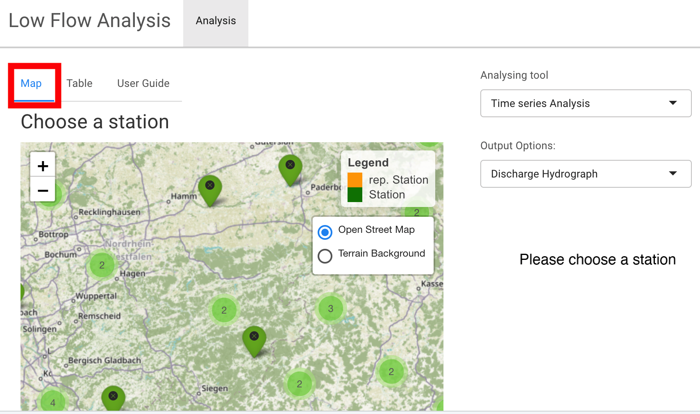
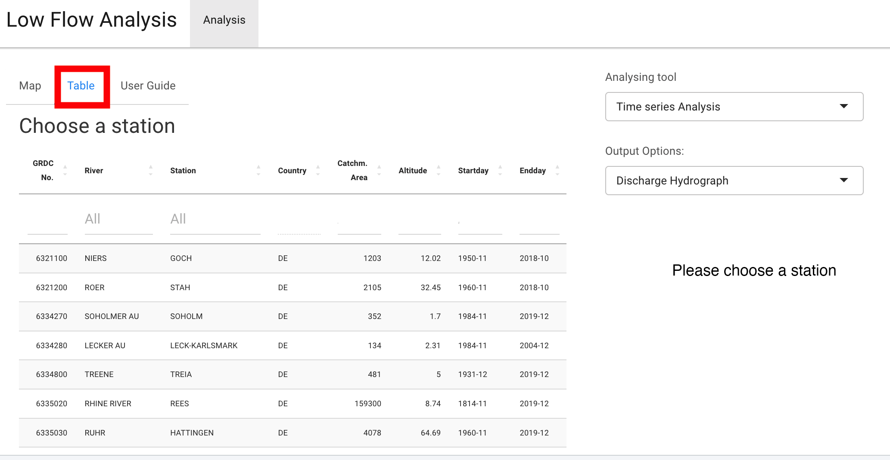
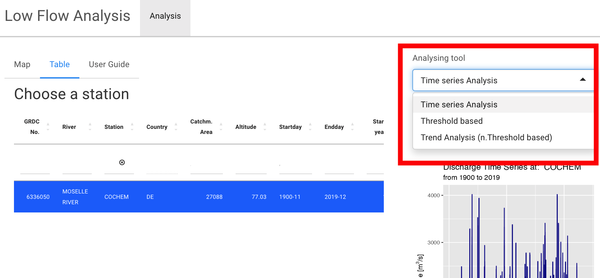

# Description of the Method and the Web App 

The Shiny Web App "'Low Water Analysis for Germany"' is an online statistical analysis tool for the stations of the GRDC dataset located in Germany. All functions that are used for the data analysis are part of the R-Package: lfanalyse and publicly available on github: https://github.com/maibrittbergh/lfanalyse. Please feel free to use, check or extend the package.

The goal of the Web App is to create a tool for a stationbases low flow analysis

## Tutorial for the Methods used in the script 

The tutorial was created to interactively understand the applied statistical methods, using R. Please find the tutorial on github: https://github.com/maibrittbergh/statisticalmanual/blob/main/statisticalintroduction.md

## Users Guide for the Web App

### The Analysis 

#### 1. Step: Choose a station

Please click on a station of your interest on the map or choose a station in the table.

##### The Map 

The map distinguishes the stations in representative stations and stations. This classification does not claim to be absolute. It was made on the basis of the length of the measurement series and the location of the station and is only intended to provide an easy introduction for people who are dealing with the topic for the first time. 

##### The Table 

The table provides all information of the metadata set. Therefore, the presentation of the metadata in the tabular form enables the search or sorting of the stations according to certain characteristics of a measurement series or a measurement station. The metadata set contains information on the GRDC number, the river name, the name of the measurement station, the catchment size, the altitude, the start and end year, as well as the start and end month, the length of the measurement series, the geographical location and the status (representative/non-representative).

#### 2. Choose the Analysing tool 

##### Time series Analysis: Descriptive statistics

To begin with the analysis it is best to get an overview of the time series. Possible questions reasons be to look for abrupt changes in the flow regime which could indicated human interference with the basin. It is also interesting to look for the average discharge value, the spread of the values, the seasonality and the general data availability. To be able to answer these or other questions related to the time series, the app as well as the R-packages combines fucntions to plot the:

- discharge hydrograph (over the entire timeseries)
- annual discharge hydrograph 
- rasterplot (over the entire timeseries)
- timeslice analysis to compare two different time slices with each other 
- boxplot of the measured discharge values (over the entire timeseries)
- annual boxplot
- seasonal plot

##### Threshold based analysis

The threshold based analysis is a tool to display low flow periods. The threshold value which characterizes low flow events can be determined manually or can be calculated quantilbased from the dataset. The low flow period can be calculated for every hydrological year of the time series. While the hydrograph is displayed in blue, the volume under the threshold is coloured red. At the bottom of the plot you can find the longest low flow period (highest number of consecut, five days where the measured value was below the low flow threshold within the chosen year), the total volume deficite as well as the total number of days below the threshold. 

##### Trend Analysis 

The last tool is the trend calculation. To avoid mistakes it is recommended to only calculate and interpretate the trend after looking at the descriptive statistics. 
The trends are calculated from not threshold based low flow 
key figures: 

- the annual minimum discharge value 
- the NMxQ-value
- the mean value (not a low flow key figure)

Please check the descriptions of the functions to receive more information about the way, these figures are calculated and what they signify. 

For each characteristic value, the trends were calculated according to two different methods, please check out the tutorial to find more information about the trend calculation and to try a hands on discharge analysis from the scratch. 

